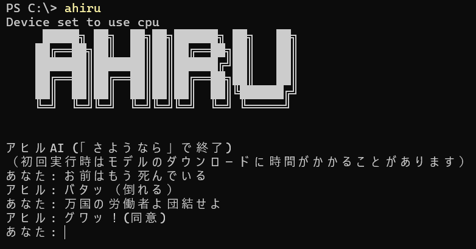

# AHIRU-CODE

## 概要

ユーザーが入力した日本語のテキストから感情を分析し、その感情にマッチしたアヒル語の鳴き声や行動を返します。



## 実行方法

### 🚀 クイックスタート

**前提条件:** Python 3.8以上がインストールされていること

1. **展開したフォルダに移動**

   ```shell
   cd "展開したフォルダのパス"
   ```

   例: `cd "C:\Users\username\Downloads\ahiru-code-main"`

2. **ライブラリをインストール**

   ```shell
   pip install -r requirements.txt
   ```

3. **どこからでも実行できるようにセットアップ**

   **PowerShell（推奨）:**

   ```powershell
   .\scripts\setup.ps1
   ```

   **コマンドプロンプト:**

   ```cmd
   scripts\setup.bat
   ```

4. **新しいターミナルを開いて実行**

   ```shell
   ahiru
   ```

### 🖥️ VS Code環境での使用

VS Codeで展開したフォルダを開いてから：

**PowerShell関数として登録（推奨）:**

```powershell
.\scripts\vscode_setup.ps1
```

VS Code再起動後、どこからでも `ahiru` コマンドが使用可能

**直接実行:**

```powershell
.\ahiru.cmd
# または
python scripts\ahiru.py
```

### 🔧 その他の実行方法

**PATH設定なしで直接実行:**

```shell
python scripts\ahiru.py
```

**PowerShell実行ポリシーエラーが出る場合:**

```powershell
Set-ExecutionPolicy -ExecutionPolicy RemoteSigned -Scope CurrentUser
```

**PATH設定確認:**

```shell
.\scripts\check_path.bat
```

### 💬 使用方法

プログラムを起動すると、コンソールでアヒルAIと対話できます：

- 日本語で話しかけると、感情に応じたアヒル語で応答します
- 終了するには `exit` または `さようなら` と入力してください
- 初回実行時はモデルのダウンロードに時間がかかることがあります

## ファイル構造

```text
ahiru-code/
│
├── README.md               # このファイル
├── requirements.txt        # 必要なライブラリ一覧
├── ahiru.cmd               # メイン実行ファイル（ユーザー用）
│
├── src/                    # ソースコード
│   ├── main.py             # AIのメインプログラム
│   ├── vad_analyzer.py     # VADスコアを分析・算出するモジュール
│   └── duck_translator.py  # VADスコアに対応するアヒル語を選択するモジュール
│
├── scripts/                # 実行・セットアップスクリプト
│   ├── ahiru.py            # Python実行スクリプト
│   ├── ahiru_ps.ps1        # PowerShell用スクリプト
│   ├── ahiru_profile.ps1   # PowerShell関数定義
│   ├── vscode_setup.ps1    # VS Code用セットアップスクリプト
│   ├── setup.bat           # セットアップスクリプト（CMD用）
│   ├── setup.ps1           # セットアップスクリプト（PowerShell用）
│   └── check_path.bat      # PATH設定確認スクリプト
│
├── tools/                  # 開発・デバッグツール
│   ├── test_ahiru.ps1      # ahiruコマンドテストスクリプト
│   ├── debug_pathext.bat   # PATHEXT確認スクリプト
│   └── cleanup.bat         # ファイルクリーンアップスクリプト
│
├── data/                   # データファイル
│   ├── duck_language.csv         # 基本のアヒル語表現データ
│   ├── duck_language_short.csv   # 短いアヒル語表現データ
│   ├── duck_language_long.csv    # 長いアヒル語表現データ
│   └── duck_language_neutral.csv # ニュートラルなアヒル語表現データ
│
└── assets/                 # アセット
    ├── ascii_art.txt       # ASCIIアート
    └── description.png     # 概要説明画像
```
